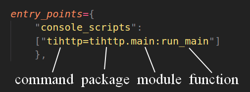

# 5. Distribution by Setup File

This repository contains the code belonging to the fifth section of the article "[The Evolution of a Script](https://the-coding-lab.com/posts/the-evolution-of-a-script/)".

Writing shell scripts for installing your packages is not common nowadays. The easy way is to create a `setup.py` file and let `pip` help you!

```python
import pathlib
import setuptools

setuptools.setup(
    name="tihttp",
    version="0.1.0",

    package_dir={"": "src"},
    packages=setuptools.find_packages(where="src"),

    install_requires=[
        "requests>=2.21",
    ],

    entry_points={
        "console_scripts":
        ["tihttp=tihttp.main:run_main"]
        },
)
```

If you're creating a command line tool, it tool should be easily called by its name as a command. The `entry_points` value describe where the entry point to your command line application is. We define `tihttp` as our entry point. The expression after the semicolon points to the function which is called to enter the tool.

<p align="center">
    
</p>

We can now easily install the tool locally.

```bash
git clone https://github.com/NiklasTiede/tinyHTTPie/tree/5-Distributing-by-Setup-File.git
cd tinyHTTPie
pip install .
tihttp -H google.com        # test
```

BTW: `pip install -e .` is the editable mode, so this connects your project with your virtual environment so that you can easily continue developing your project with no need to repeatedly install/uninstall it.

Or install the project directly from github!

```bash
pip install https://github.com/NiklasTiede/tinyHTTPie/archive/5-Distributing-by-Setup-File.zip
```

Direct installation from github can take much time especially for projects which are bigger and use non-Python languages. Therefore PyPI and Anaconda are usually the preferred places where to to go.

<div>
<p align="center"><a href="https://github.com/NiklasTiede/tinyHTTPie/tree/4-Distributing-by-Installscript"><< section 4</a> | <a href="https://github.com/NiklasTiede/tinyHTTPie/tree/6-Testing-and-CI">section 6 >></a> </p>
</div>
